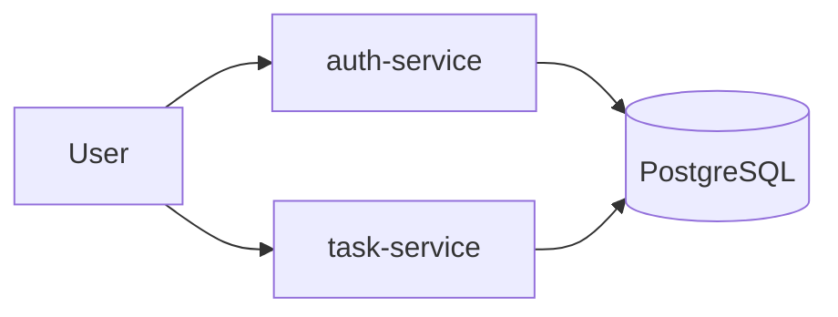

# SecureTaskHub

I built this project as a practical DevSecOps portfolio case for a Java/Spring Boot role.
The goal is to show that I can design a small microservice system, secure it, test it, containerize it, and enforce quality gates in CI.

- Repository: [LevinLev1/secure-task-hub](https://github.com/LevinLev1/secure-task-hub/tree/main)
- Current development version: `0.1.0`
- Runtime paths: Docker Compose and local Kubernetes (`kind`)

## What is implemented

| Component | Responsibility | Key points |
| --- | --- | --- |
| `auth-service` | Registration and login | BCrypt password hashing, JWT issuance, roles |
| `task-service` | Protected task CRUD | Owner scoping, `ROLE_ADMIN` override, JWT validation |
| PostgreSQL | Shared data store | Demo setup for both services |
| Flyway | Schema migrations | Runs in `auth-service`; `task-service` uses `ddl-auto: validate` |
| Observability | Operational visibility | JSON logs, `X-Correlation-Id` + MDC, audit log records |

## Architecture



Detailed architecture and request flow: `docs/architecture.md`.

## Security controls

- Spring Security and stateless JWT auth in both services
- Role model: `ROLE_USER` and `ROLE_ADMIN`
- Password hashing with `BCrypt`
- Secrets provided via environment variables / Kubernetes `Secret`
- Container hardening: non-root, reduced capabilities, read-only root filesystem
- Additional browser-facing hardening headers (`Permissions-Policy`, `COOP`, `COEP`, `CORP`)
- Kubernetes health probes, resource limits, and `NetworkPolicy`
- CI security checks with Trivy, Grype, Semgrep, and Checkov

Detailed rationale: `docs/security-decisions.md`.

## CI quality gates

Workflow: `.github/workflows/ci.yml`

| Stage | Tool | Why it is used | Fails when |
| --- | --- | --- | --- |
| Stage 1 | Maven verify + Testcontainers | Prove functional correctness before security gates | Tests fail |
| Stage 1 | Trivy fs (`secret`) — **Secret Detection** | Secret detection in source/config files before build | `HIGH`/`CRITICAL` findings |
| Stage 1 | Trivy fs (`vuln`) — **Source SCA** | Dependency vulnerability scan at source/filesystem level | `HIGH`/`CRITICAL` findings |
| Stage 1 | Trivy fs (`misconfig`) — IaC checks | IaC/config misconfiguration scan on repository files | `HIGH`/`CRITICAL` findings |
| Stage 1b | **SAST (Semgrep)** (`p/java`, `p/security-audit`) | Static analysis for Java/security anti-patterns | Rule violations |
| Stage 1c | **IaC policy (Checkov/K8s)** | Kubernetes policy-as-code checks | Non-skipped failing checks |
| Stage 2 | Trivy image + Grype — **Binary SCA** | Vulnerability scan of built Docker image artifacts | High/Critical vulnerability threshold |
| Stage 2 | Trivy config (`infra/k8s`) — IaC checks | Misconfig scan on Kubernetes manifests as deployed | `HIGH`/`CRITICAL` findings |
| Stage 3 (manual/feature) | OWASP ZAP baseline (`.github/workflows/dast.yml`) | DAST smoke security scan against running services | Fails on scan/runtime errors, uploads report artifacts |

## Local pre-commit checks

To catch common issues before push, this repository includes `.pre-commit-config.yaml` with:

- basic formatting/safety hooks (`trailing-whitespace`, `end-of-file-fixer`, `check-yaml`, merge conflict markers)
- `gitleaks` secret detection

Setup:

```bash
pip install pre-commit
pre-commit install
pre-commit run --all-files
```

## Run locally

### Option A: Docker Compose

```bash
docker compose -f infra/docker-compose.yml up --build
```

- Auth Swagger: `http://localhost:8081/swagger-ui.html`
- Task Swagger: `http://localhost:8082/swagger-ui.html`
- Note: Swagger is intentionally open in this pet project for demo convenience. In production, disable or restrict it.

### Option B: Kubernetes (`kind`)

```bash
make kind-up
kubectl get pods -n secure-task-hub -w
```

In separate terminals:

```bash
make pf-auth
make pf-task
```

- Auth Swagger: `http://localhost:8081/swagger-ui.html`
- Task Swagger: `http://localhost:8082/swagger-ui.html`
- Note: Swagger is intentionally open in this pet project for demo convenience. In production, disable or restrict it.

## Quick API check

1. Register user:

```bash
curl -X POST http://localhost:8081/api/auth/register \
  -H "Content-Type: application/json" \
  -d "{\"username\":\"alice\",\"email\":\"alice@example.com\",\"password\":\"StrongPass123\"}"
```

2. Login and copy `accessToken`:

```bash
curl -X POST http://localhost:8081/api/auth/login \
  -H "Content-Type: application/json" \
  -d "{\"username\":\"alice\",\"password\":\"StrongPass123\"}"
```

3. Create task:

```bash
curl -X POST http://localhost:8082/api/tasks \
  -H "Authorization: Bearer <TOKEN>" \
  -H "Content-Type: application/json" \
  -d "{\"title\":\"Review CI findings\",\"description\":\"Check scan gates\",\"status\":\"OPEN\"}"
```

## Versioning and branches

- Versioning model: SemVer (`MAJOR.MINOR.PATCH`)
- Current line: `0.1.0`
- Release tag format: `vX.Y.Z` (example: `v0.1.0`)
- Branch roles:
  - `main`: stable, green CI, portfolio-ready
  - `feature/*`: normal development
  - `demo/*`: intentionally vulnerable or failing scanner demonstrations, isolated from `main`

Details: `docs/versioning.md`, `CHANGELOG.md`, `.github/workflows/release.yml`.

## Planned next steps

- Add a dedicated demo branch with intentionally insecure examples for scanner walkthroughs
- Build OAuth2/OIDC version in a separate feature branch
- Publish release notes for each SemVer tag
- Add production profile defaults for Swagger restriction and stricter CSP policy
