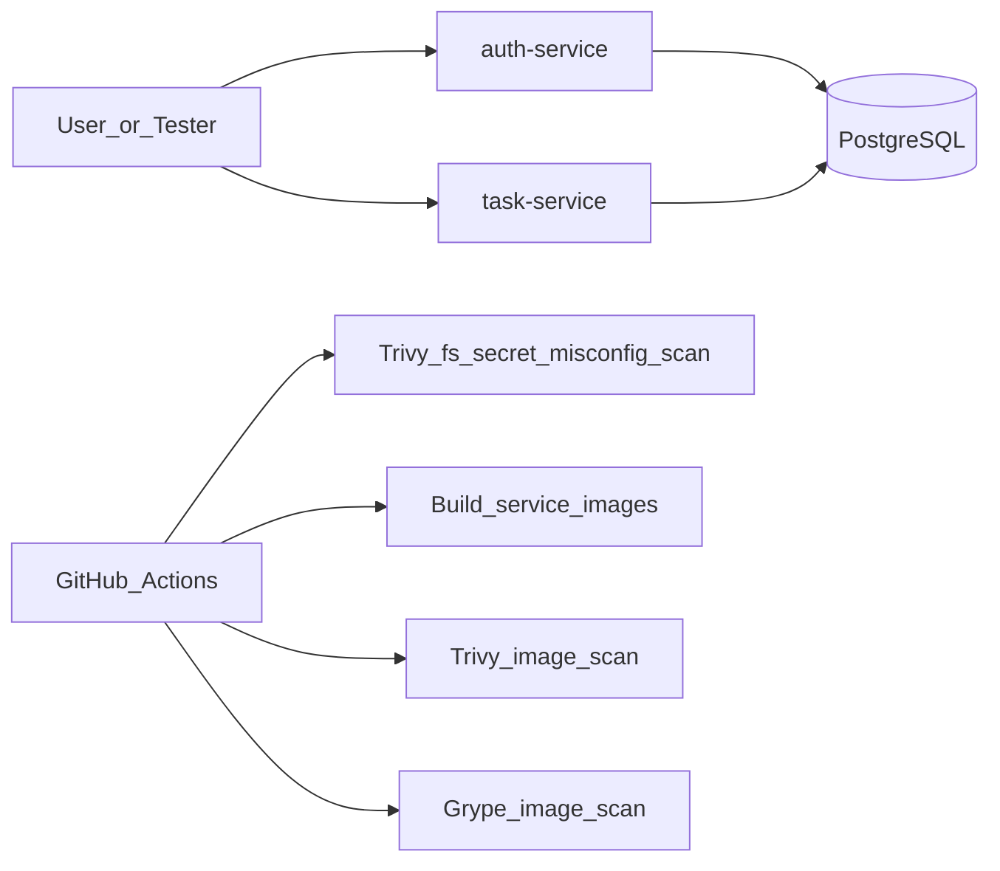

# SecureTaskHub

`SecureTaskHub` is a small DevSecOps-oriented pet project for a Java/Spring Boot vacancy. It demonstrates how to build, containerize, scan, and prepare a simple microservice application for Kubernetes without turning the project into a large platform.

## What is inside

- `auth-service`: registration, login, password hashing with `BCrypt`, JWT issuance, role model.
- `task-service`: protected CRUD for tasks with owner scoping and `ROLE_ADMIN` override.
- `PostgreSQL`: shared database for a small demo setup.
- `Flyway`: versioned SQL migrations in `auth-service` (`db/migration`); `task-service` uses `ddl-auto: validate` and does not run Flyway (avoids two writers to `flyway_schema_history` on one database).
- `Docker` and `docker-compose`: local start of the full stack; `task-service` waits until `auth-service` is healthy so migrations have been applied.
- `Kubernetes` manifests: deployments, services, config, secrets, probes, resources, network policy.
- `GitHub Actions`: build, test, filesystem scan, container scan with `Trivy` and `Grype`.

## Versioning (SemVer)

The project uses **semantic versioning** in `pom.xml` (for example `0.1.0`). Bump **major.minor.patch** when you change behavior in a way people should notice. Git tags like `v0.1.0` can match releases; image tags in Kubernetes are documented in `infra/k8s` when you publish to a registry.

## CI vs local Kubernetes (`kind`)

**GitHub Actions** on the free tier runs build, tests, and security scans without extra paid features. Running a **real `kind` cluster inside CI** is possible but heavier (Docker-in-Docker, longer jobs, more moving parts). For this pet project, **Kubernetes with `kind` is intended to run on your machine** (see below). CI stays focused on **quality gates**; local `kind` is where you practice **deploy** end-to-end.

## Architecture



## Repository layout

- `services/auth-service`
- `services/task-service`
- `infra/docker-compose.yml`
- `infra/k8s/base/secure-task-hub.yaml`
- `.github/workflows/ci.yml`
- `docs/architecture.md`
- `docs/security-decisions.md`

## Security controls showcased

- `Spring Security` in both services
- stateless auth with `JWT`
- `ROLE_USER` and `ROLE_ADMIN`
- password hashing with `BCrypt`
- environment-based secrets
- reduced actuator exposure
- container images running as non-root
- multi-stage Docker builds
- Kubernetes readiness and liveness probes
- Kubernetes `ConfigMap`, `Secret`, `NetworkPolicy`, and resource limits
- CI scanning with `Trivy` and `Grype`

## Database migrations

Schema is created by Flyway migration `services/auth-service/src/main/resources/db/migration/V1__init_schema.sql` (tables `users` and `tasks`). Hibernate **does not** auto-update tables in production-like mode: `ddl-auto` is `validate`.

If you previously ran the stack when Hibernate used `ddl-auto: update`, your Docker volume may already contain tables **without** Flyway history. In that case either:

- reset the volume: `docker compose -f infra/docker-compose.yml down -v` then `up --build`, or  
- run Flyway repair/baseline manually (advanced).

For local development **without** Docker, start **`auth-service` before `task-service`** so migrations run first.

## Local run with Docker Compose

From the repository root:

```bash
docker compose -f infra/docker-compose.yml up --build
```

Services:

- `auth-service`: `http://localhost:8081`
- `task-service`: `http://localhost:8082`
- `postgres`: `localhost:5432`

## Example API flow

1. Register a user:

```bash
curl -X POST http://localhost:8081/api/auth/register \
  -H "Content-Type: application/json" \
  -d "{\"username\":\"alice\",\"email\":\"alice@example.com\",\"password\":\"StrongPass123\"}"
```

2. Login and copy the `accessToken`:

```bash
curl -X POST http://localhost:8081/api/auth/login \
  -H "Content-Type: application/json" \
  -d "{\"username\":\"alice\",\"password\":\"StrongPass123\"}"
```

3. Create a task:

```bash
curl -X POST http://localhost:8082/api/tasks \
  -H "Authorization: Bearer <TOKEN>" \
  -H "Content-Type: application/json" \
  -d "{\"title\":\"Review CI findings\",\"description\":\"Check Trivy and Grype output\",\"status\":\"OPEN\"}"
```

## Local Kubernetes

Use **`kind` on your PC** (install `kind` + `kubectl`). Load locally built images into the cluster or point manifests at images you pushed to a registry.

Apply manifests:

```bash
kubectl apply -f infra/k8s/base/secure-task-hub.yaml
```

Before doing that, replace the placeholder container image names in `infra/k8s/base/secure-task-hub.yaml` with your own published images.

With Flyway only on `auth-service`, ensure **`auth-service` pods are ready** (migrations applied) before `task-service` traffic hits the API, or restart `task-service` once auth is up. For a small demo, applying manifests once and waiting for rollouts is usually enough.

## First push to GitHub from Windows

Use **PowerShell** or **Git Bash** (from [Git for Windows](https://git-scm.com/download/win)), not necessarily classic `cmd.exe`.

1. Install **Git for Windows** if `git --version` fails. During setup, choose **“Git from the command line and also from 3rd-party software”** so `git` is on your `PATH`.
2. Open **PowerShell**, go to the project:

   ```powershell
   cd C:\Users\levin\.cursor\projects\secure-task-hub
   git --version
   ```

3. If the folder is **not** a repo yet:

   ```powershell
   git init
   git add .
   git commit -m "Initial commit: SecureTaskHub"
   git branch -M main
   ```

4. On GitHub, create a **new empty repository** (no README if you want to avoid merge noise). Then:

   ```powershell
   git remote add origin https://github.com/YOUR_USER/YOUR_REPO.git
   git push -u origin main
   ```

   Use your real URL. On first push, GitHub may ask you to log in: **Personal Access Token** as password (HTTPS) or set up **SSH**.

**GitHub CLI (`gh`)** is optional: `gh repo create` can create the repo and add `origin` in fewer steps, but plain `git` is enough. If `git init` “does not work” in CMD, usually **`git` is not in PATH** for that window — install Git for Windows and open a **new** PowerShell, or use **“Git Bash”** from the Start menu.

## CI pipeline

The workflow in `.github/workflows/ci.yml` does the following:

- builds and tests the Maven project
- runs `Trivy` filesystem scan for vulnerabilities, secrets, and misconfiguration
- builds both service images
- scans both images with `Trivy`
- scans both images with `Grype`
- fails on `HIGH` and `CRITICAL` findings

## Notes

- This repository currently assumes Java 17 and Maven are available in CI.
- For a next iteration you can add Testcontainers, OpenAPI, and stronger observability; the baseline stays small on purpose.
