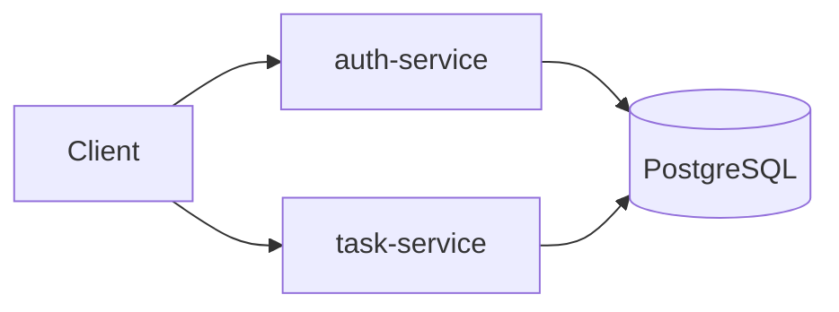
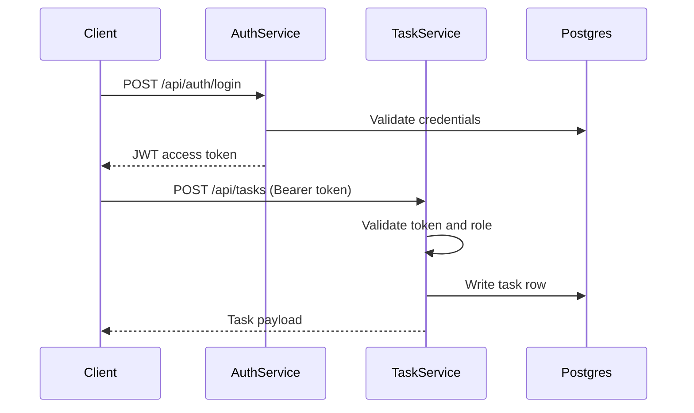

# Architecture Overview

## Design objective

This repository is intentionally compact: two services, one database, and a CI pipeline with security gates.  
The design goal is to demonstrate production-adjacent engineering decisions without adding unnecessary platform complexity.

## System components

### `auth-service`

- Handles registration and login
- Stores users with `BCrypt` password hashes
- Issues JWT access tokens
- Runs Flyway migrations for shared schema

### `task-service`

- Exposes protected CRUD API for tasks
- Validates JWT tokens
- Enforces owner scoping with admin override
- Uses `ddl-auto: validate` against schema created by Flyway

### PostgreSQL

- Single database for demo scope
- Contains `users`, `tasks`, and `audit_log` tables

## Runtime model

## Request flow

## Configuration and deployment

- `infra/docker-compose.yml`: local all-in-one runtime
- `infra/k8s/base/secure-task-hub.yaml`: Kubernetes manifests
- `infra/k8s/kustomization.yaml`: local `kind` image overrides (`:local` tags)
- `Makefile`: common commands for compose, kind, image loading, and port-forwarding

## Migration ownership

- Flyway runs only in `auth-service`
- `task-service` does not run Flyway and validates schema on startup
- Startup ordering in Compose ensures migrations are complete before task API is used

This split keeps one migration owner and avoids race conditions around `flyway_schema_history`.

## Testing and observability

- Integration tests use Testcontainers and PostgreSQL during `mvn verify`
- Both services expose health probes via Spring Boot Actuator
- Logs are JSON-formatted and include correlation ID propagation
- Security-sensitive actions are captured in `audit_log`
