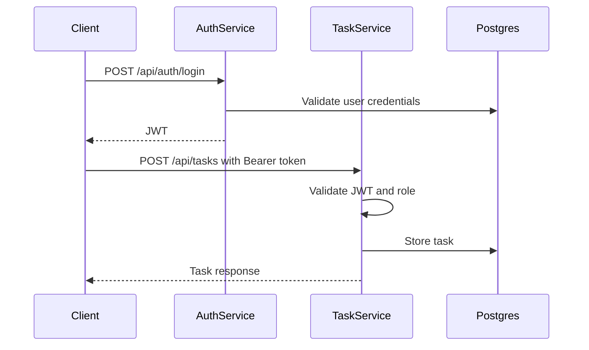

# Architecture Overview

## Goal

This project is intentionally small. The objective is not to simulate a full enterprise platform, but to show a realistic DevSecOps-ready delivery flow around a Java microservice application.

## API documentation

Each service exposes **OpenAPI 3** and **Swagger UI** via `springdoc-openapi`. Use Swagger to try endpoints interactively; for `task-service`, obtain a JWT from `auth-service` and use **Authorize** (HTTP bearer) in Swagger UI.

## Automated testing

**Testcontainers** starts a real **PostgreSQL** container during `mvn verify`. `auth-service` integration tests exercise register/login against migrated schema; `task-service` tests apply the same migration SQL from test resources (kept in sync with `auth-service`), generate a signed JWT, and verify task CRUD over HTTP.

## CI stages

GitHub Actions runs **Stage 1** (build, tests, filesystem Trivy: secrets, vulns, misconfig) then **Stage 2** (Docker image build, Trivy image + **Trivy config** on Kubernetes manifests, Grype on images).

## Services

### `auth-service`

Responsibilities:

- register new users
- validate credentials
- hash passwords with `BCrypt`
- issue signed JWT tokens
- expose health endpoints for platform checks

Public endpoints:

- `POST /api/auth/register`
- `POST /api/auth/login`
- `GET /actuator/health`

### `task-service`

Responsibilities:

- create, read, update, and delete tasks
- trust JWT issued by `auth-service`
- allow users to access only their own tasks
- allow admins to access all tasks
- expose health endpoints for platform checks

Public endpoints:

- `GET /api/tasks`
- `GET /api/tasks/{id}`
- `POST /api/tasks`
- `PUT /api/tasks/{id}`
- `DELETE /api/tasks/{id}`

## Database migrations

Both services use the **same PostgreSQL database** in the demo setup. **Flyway runs only in `auth-service`**, which owns `src/main/resources/db/migration`. That way a single `flyway_schema_history` table and one ordered migration stream apply to the shared database.

`task-service` sets `spring.flyway.enabled=false` and `spring.jpa.hibernate.ddl-auto=validate`, so it expects the schema that Flyway already created and fails fast if entities and tables diverge.

In Docker Compose, `task-service` waits for `auth-service` to pass its readiness probe so migrations have completed before the task app validates JPA mappings.

## Data model

### `users`

- `id`
- `username`
- `email`
- `password_hash`
- `role`

### `tasks`

- `id`
- `title`
- `description`
- `status`
- `owner_username`
- `created_at`
- `updated_at`

## Request flow

## Deployment model

### Local development

- `docker-compose` runs:
  - PostgreSQL
  - `auth-service`
  - `task-service`

### Kubernetes demo deployment

- one namespace
- one PostgreSQL deployment for demo purposes
- one deployment per service
- environment variables from `ConfigMap` and `Secret`
- `readiness` and `liveness` probes for both Spring Boot services
- resource requests and limits
- `NetworkPolicy` to demonstrate baseline traffic control

## Why this architecture works for a junior DevSecOps portfolio

- small enough to finish
- uses recognizable production-adjacent tools
- gives room to discuss secure SDLC, container hardening, and CI checks
- demonstrates both app-level and platform-level controls without requiring a large cluster
